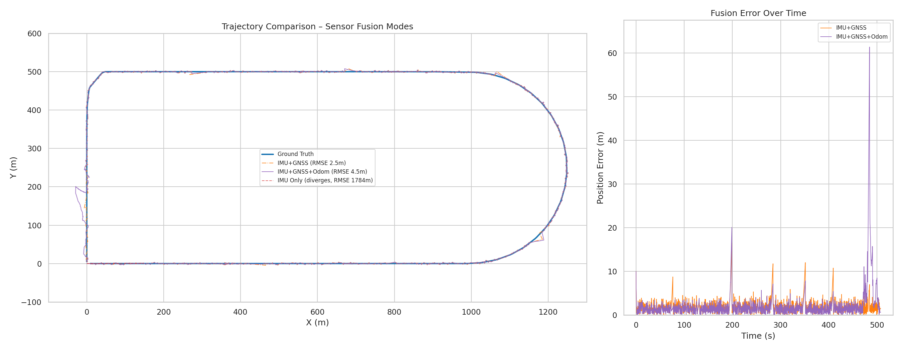
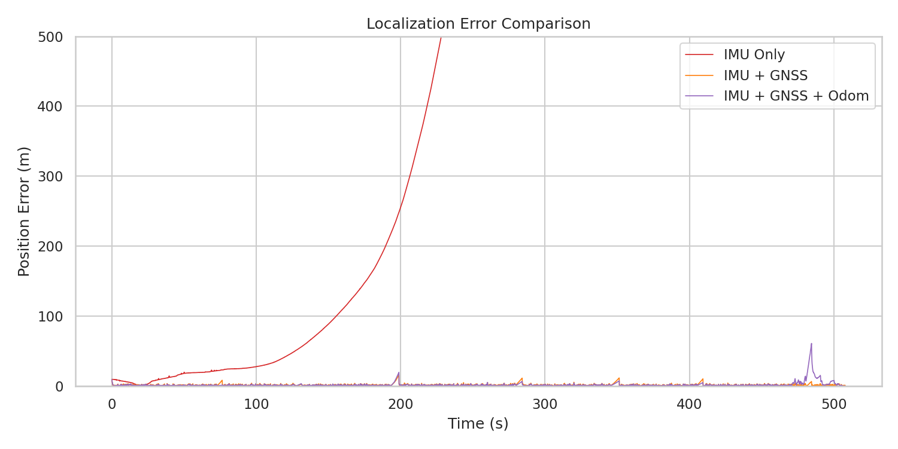
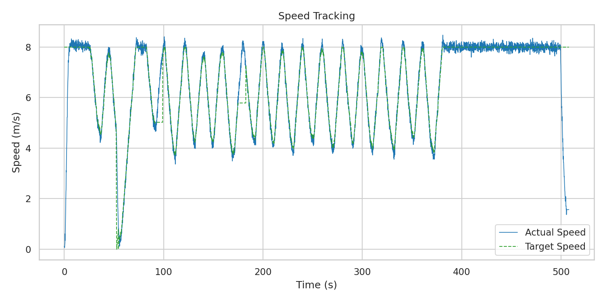
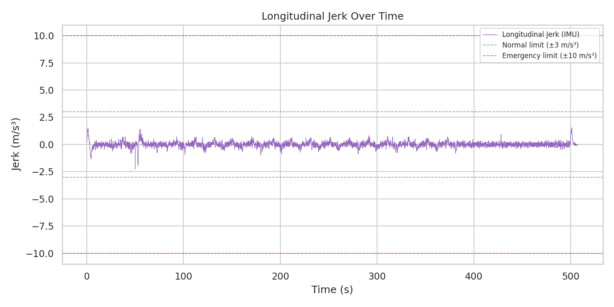

# Autonomous Vehicle Stack v3

> ROS2-based autonomous driving stack with sensor fusion, 
> LiDAR perception, and adaptive longitudinal control — 
> built for reproducible simulation and iterative tuning.

---

## Why I built this

I wanted to understand how the core components of an autonomous 
stack — localization, perception, and control — actually connect 
in a real ROS2 system, not just in theory.

This project is the result of that: a full closed-loop simulation 
pipeline I could tune, break, fix, and measure. The hardest part 
was getting smooth longitudinal control — balancing ACC-style 
car-following, speed limit tracking, and emergency braking without 
the jerk spiking under edge cases.

---

## What the stack does

- **Synthetic sensor suite** — GNSS + IMU + LiDAR + wheel odometry
  with configurable noise, biases, and designed GNSS dropouts
- **6-state EKF localization** — fuses all sensors with adaptive
  measurement noise; stays stable across 8 planned GNSS outages
- **LiDAR lead-vehicle detection** — ROI filtering + Euclidean
  clustering to extract lead vehicle distance
- **ACC-style longitudinal controller** — feed-forward + PID,
  jerk limiting, TTC emergency braking
- **Evaluation tooling** — CSV logging, offline metrics,
  auto-updating run comparison table

---

## Key results (latest run)

| Metric | Value | vs previous run |
|---|---|---|
| EKF RMSE | 10.87 m | ↓ 12.6% |
| EKF Mean Error | 7.98 m | ↓ 28.8% |
| Avg jerk | 0.183 m/s³ | ↓ 25.8% |
| GNSS dropout handling | ✅ 0 failures | ↓ from 14 |

Localization error is highest in curved segments (higher yaw rate),
but bounded within acceptable limits across the full run.

---

## Selected plots

### Trajectory — fusion mode comparison

IMU-only dead reckoning diverges quickly. 
GNSS+IMU+odometry fusion achieves the lowest RMSE.

### Localization error over time

EKF error stays bounded during GNSS availability.
During outages, IMU+odometry limits drift gracefully.

### Speed tracking


### Jerk distribution


---

## Stack layout
```
src/
  testing/test_data        # synthetic scenario runner
  localization/ekf_localization   # EKF node (GNSS/IMU/odometry fusion)
  perception/vehicle_detection    # LiDAR-based lead vehicle detection
  control/pid_control             # ACC longitudinal controller
  evaluation/evaluation_tools     # CSV logger + plots + compare_runs.py
config/
  sensor_config.yaml
  ekf_params.yaml
  pid_params.yaml
```

---

## Running it

### Docker (recommended)
```bash
cd autonomous_vehicle_stack_v3/docker
docker compose up --build
```
Runs full simulation, writes logs to `results/`, plots to 
`results/plots/`.

### Native ROS2 (Linux/macOS)
```bash
colcon build --symlink-install
source install/setup.bash
ros2 launch launch/autonomy_stack.launch.py sim_mode:=synthetic
```

---

## Tuning & extending

- EKF behavior → `config/ekf_params.yaml`
- Controller gains → `config/pid_params.yaml`
- Scenario (track, lead vehicle, dropout schedule) → 
  `src/testing/test_data/test_data_node.py`
- Add metrics → `src/evaluation/evaluation_tools/`

EKF math is documented in `docs/ekf_math.md`.